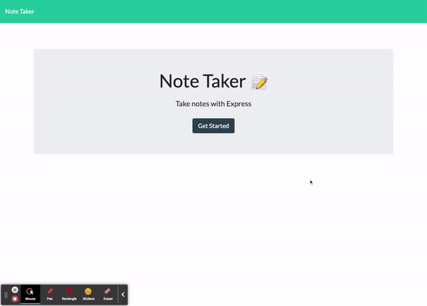

# note-taker

Homework#9 - Note Taker w/ Express

## what did I do?

This assignment included writing routes for a pre-built application. Inspecting the supplied 'index.js' file led to clues on how to handle the routing. Parsing and strigifying were used to read and write the JSON data (used as a local database) and the routes were written with this in mind.

## what do I need to explain

Much of the code was already supplied. Some of the functionality of the UI isn't intuitive at first glance (the '+' icon) but the project is operating as wanted/expected. FYI.

## screenshot of final product

